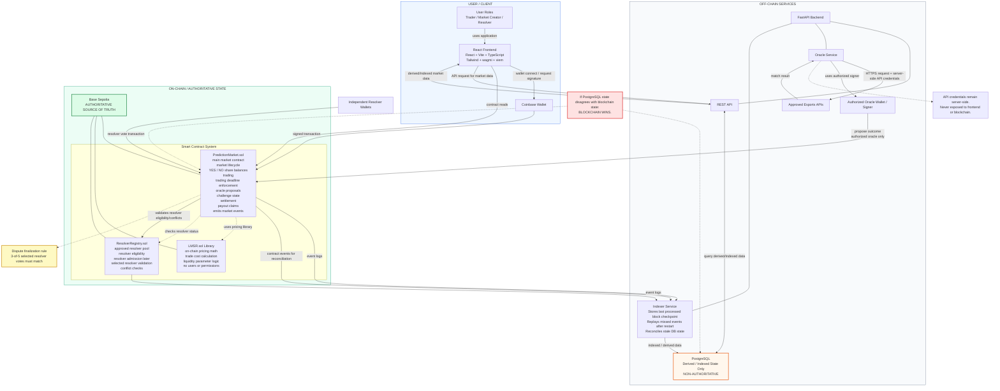
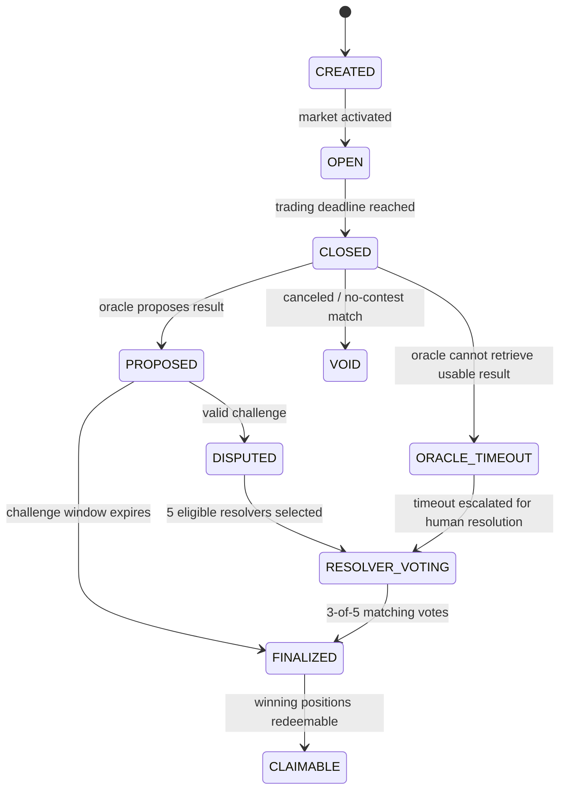
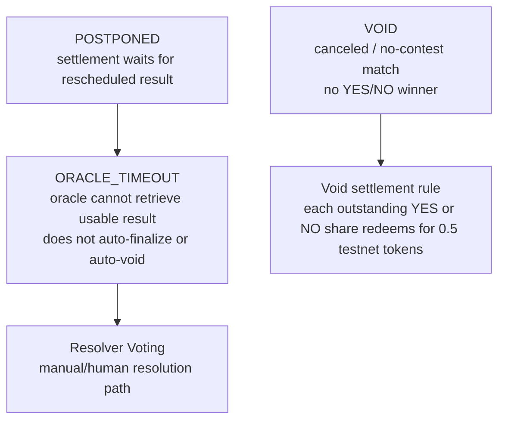

# AC_ON Architecture Preview

AC_ON is a testnet-only decentralized esports prediction market. Users connect Coinbase Wallet and trade YES/NO shares on binary esports match outcomes.

Core market logic is planned to run on-chain on Base Sepolia. Off-chain services support esports API access, oracle automation, indexing, PostgreSQL derived data, and FastAPI queries. The system is not fully trustless or fully permissionless.

## Main System Architecture

### Authorization Notes

- The oracle may propose outcomes through an authorized oracle wallet.
- The oracle may not directly settle disputed markets, bypass the challenge period, or vote as a human resolver.
- Resolver wallets are independent from the automated oracle.
- Resolver voting authorization is enforced by contracts:
  - active resolver
  - selected for the dispute
  - no prohibited conflict
- The market creator, result proposer, and challenger must not resolve their own disputed market.

### On-Chain Contract Split

- `PredictionMarket.sol` is the main user-facing contract for market state, trading, disputes, settlement, and claims.
- `LMSR.sol` is a Solidity library used by `PredictionMarket.sol` for on-chain pricing math. It is not an off-chain service and users do not call it directly.
- `ResolverRegistry.sol` stores the approved resolver pool and resolver eligibility rules. `PredictionMarket.sol` checks it when resolver votes are submitted.

### Database Authority And Recovery

- PostgreSQL stores derived/indexed data only.
- PostgreSQL may contain market lists, price history, trade history, resolver history, and derived market metadata.
- PostgreSQL must not be presented as the source of truth.
- The indexer should resume from the last processed block, replay missed events, and repair stale derived state.
- PostgreSQL does not write authoritative state into smart contracts.

## Market State Machine

### Exceptional States

`ORACLE_TIMEOUT` means the system does not have a reliable result yet. It should not silently choose a winner and should not automatically become `VOID`. A timed-out market remains unresolved until it is escalated to resolver voting or another explicitly defined manual resolution path.

## Trust Model

- Core trading and settlement rules are enforced on-chain.
- External esports APIs remain trusted off-chain dependencies.
- Initial approved APIs are configured by the project team.
- The automated oracle proposes outcomes but cannot unilaterally settle challenged markets.
- The initial resolver pool is bootstrapped manually.
- Disputes are decided by multiple resolvers, not one centralized operator.
- Five eligible resolvers are selected for a dispute.
- Three matching votes are required.
- Oracle and human resolver are separate actors.

## Authority Table

| Data / Action | Authoritative Source |
| --- | --- |
| Market state | Base Sepolia smart contracts |
| YES/NO ownership | Base Sepolia smart contracts |
| LMSR pricing/trades | Base Sepolia smart contracts |
| Resolver votes | Base Sepolia smart contracts |
| Settlement | Base Sepolia smart contracts |
| Payout status | Base Sepolia smart contracts |
| Esports match result input | Approved external APIs via oracle |
| Market list cache | PostgreSQL |
| Price/trade history cache | PostgreSQL |
| UI display state | Derived from chain/backend |

## Architecture Feedback Coverage

- [x] On-chain and off-chain boundaries
- [x] Blockchain state is authoritative
- [x] PostgreSQL is derived/indexed only
- [x] Oracle wallet authorization
- [x] Resolver authorization
- [x] API credential boundary
- [x] Stale indexer recovery
- [x] Database vs blockchain disagreement behavior
- [x] Oracle and resolver are separate actors
- [x] Market state-machine diagram
